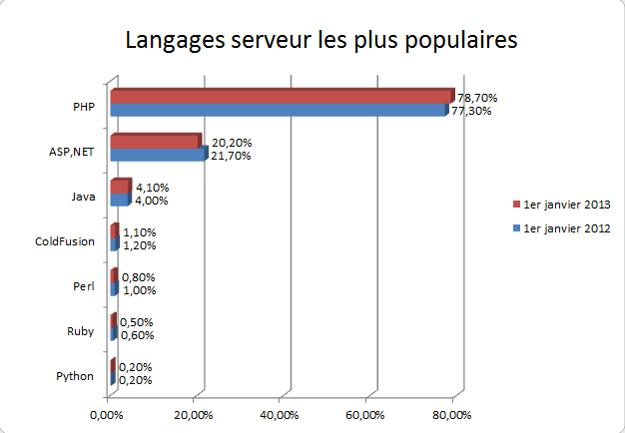

# Introduction au développement Web

L'objectif de ce chapitre est de découvrir les notions fondamentales liées au développement Web.

**Note** : ce chapitre s'inspire de la [documentation du framework PHP Symfony](http://symfony.com/doc/current/book/from_flat_php_to_symfony2.html).

## Le fonctionnement du Web

Pour consulter un site Web sur Internet, il suffit de taper l'adresse correcte du site dans la barre d'adresse d'un navigateur Web, et le site s'affiche (si l'accès au réseau fonctionne). Nous allons tenter de comprendre ce qui se cache derrière cette opération très simple en apparence. 

### La notion de serveur Web

Pour être accessible, un site Web doit être publié sur un **serveur**. Un serveur est un type particulier d'ordinateur dont le rôle est d'attendre les demandes de clients, et d'y répondre. Un serveur rend un service à ses clients.

Il existe de nombreux types de serveurs, en fonction du service rendu : serveur de fichiers, de messagerie, d'authentification... Un serveur qui permet de publier des sites Web est appelé serveur Web. 

**Note** : une même machine peut rendre différents services (exemple : serveur Web et serveur de fichiers).

Plus précisément, une machine serveur Web embarque et exécute un logiciel serveur, capable de répondre aux demandes de consultations de sites Web. Les logiciels serveurs Web les plus populaires sont [Apache](http://httpd.apache.org/), [Microsoft IIS](http://www.iis.net/) et [nginx](http://nginx.org/).

### La notion de client Web

La machine qui permet la consultation du site Web demandé est appelé **client Web**. Il s'agit d'un abus de langage : en réalité, le véritable client est un logiciel qui s'exécute sur cette machine et réalise l'opération de consultation. Ce logiciel est le plus souvent un navigateur Web (*browser*). Les navigateurs Web les plus populaires sont [Internet Explorer](http://windows.microsoft.com/fr-fr/internet-explorer/), [Mozilla Firefox](https://www.mozilla.org/fr/firefox), [Chrome](https://www.google.fr/chrome/browser/), [Safari](https://www.apple.com/fr/safari/) et [Opera](http://www.opera.com/fr).

D'autres types de logiciels que les navigateurs peuvent jouer le rôle de clients Web en se connectant à des serveurs Web. Exemples : robots d'indexation, aspirateurs Web, applications mobiles, etc.

### La communication entre client et serveur

La compréhension des échanges ayant lieu entre un client et un serveur Web lors de la consultation d'un site est essentielle. Il s'agit d'un mécanisme de type **requête/réponse**.

1. L'échange est initié par le client, qui envoie au serveur une requête pour consulter une ressource Web.
2. Le serveur prépare la page HTML associée.
3. Le serveur renvoie la page HTML au client, qui l'affiche.

Afin de se comprendre, client et serveur Web utilisent pendant leurs échanges un protocole commun : HTTP.

## Le protocole HTTP

HTTP (*HyperText Transfert Protocol*) est le protocole de transfert du Web. C'est son invention en 1989 au CERN de Genève, en même temps que le langage HTML, qui a conduit à l'apparition du World Wide Web : un immense réseau de réseaux, où on peut "rebondir" d'une page Web à une autre en utilisant des liens sans avoir besoin de connaître l'emplacement physique des serveurs et des ressources consultés.

HTTP est fondamentalement un protocole très simple, basé sur des commandes textuelles.

### Anatomie d'une requête HTTP

Prenons comme exemple la première étape de l'échange décrit plus haut.

La requête HTTP envoyée par le navigateur prend une forme similaire à celle-ci :

    GET / HTTP/1.1
    Host: xkcd.com
    Accept: text/html
    User-Agent: Mozilla/5.0 (Macintosh)

La première ligne de cette requête HTTP est la plus importante. Elle contient :

* La **méthode** associée à la requête : ici, `GET` signifie une demande de ressource.
* L'identifiant de la **ressource concernée**. Ici, `/` (symbole de la racine, comme sous Linux) indique qu'on souhaite accéder au document par défaut.
* La **version** du protocole HTTP, ici 1.1.

Les autres lignes de la requête HTTP sont appelés champs d'en-tête (*HTTP header fields* ou plus simplement *headers*). Ils précisent le site Web concerné (champ `Host`), les types de contenu acceptés par le client (champ `Accept`) et le logiciel client utilisé (champ `User-Agent`). Il existe d'autres champs d'en-tête, non présentés ici.

Les méthodes HTTP les plus fréquemment utilisées sont `GET` (pour récupérer une ressource depuis le serveur) et `POST` (pour modifier une ressource sur le serveur). Il en existe d'autres comme `HEAD`, `PUT` ou `DELETE`.

### Anatomie d'une réponse HTTP

Lorsqu'il reçoit une requête HTTP, le serveur Web y puise les informations nécessaires pour construire la réponse, puis la renvoie au client. Continuons avec notre exemple précédent.

La réponse HTTP renvoyée du serveur au client prend l'aspect ci-dessous.

    HTTP/1.1 200 OK
    Date: Mon, 14 Apr 2013 14:05:05 GMT
    Server: lighttpd/1.4.19
    Content-Type: text/html

    <html>
        <!-- code HTML de la page -->
        <!-- ... -->
    </html>

La première ligne de la réponse contient son **statut** sous la forme d'un code qui indique le résultat de la requête. Comme une requête, une réponse HTTP contient des champs d'en-tête (`Date`, `Content-Type` et bien d'autres) permettant de véhiculer des informations additionnelles. Par exemple, il est possible d'utiliser certains champs pour mettre en place un mécanisme de cache.

Enfin, la réponse HTTP contient éventuellement la ressource demandée par le client. Le plus souvent, il s'agit d'une page Web décrite sous la forme de balises HTML. 

### Les codes HTTP

Les codes de retour HTTP peuvent être classés par familles en fonction du premier chiffre.

Famille | Signification | Exemples
--------|---------------|---------
**1xx** | Information |
**2xx** | Succès | 200 : requête traitée avec succès
**3xx** | Redirection |
**4xx** | Erreur provenant du client | 400 : syntaxe de la requête erronée 404 : ressource demandée non trouvée
**5xx** | Erreur provenant du serveur | 500 : erreur interne du serveur            503 : service temporairement indisponible

Vous trouverez sur [Wikipedia](http://fr.wikipedia.org/wiki/Hypertext_Transfer_Protocol) plus de détails sur le protocole HTTP.

### La notion d'URL

On a l'habitude d'accéder à un site Web en utilisant son adresse. Celle-ci est de la forme : `http://www.monsite.fr/mondossier/mapage.html`. On peut décomposer cette adresse en plusieurs sous-parties.

* `http://` signifie qu'on utilise le protocole HTTP.
* `www.monsite.fr` est le nom de domaine du site Web visité.
* `/mondossier/mapage.html` est le chemin de la ressource demandée au sein du site.

La majorité des serveurs Web est configurée pour renvoyer une page par défaut (`index.html`, `index.php`, `Default.aspx`) lorsque le client ne précise pas explicitement quelle page il souhaite récupérer (exemples : http://www.monsite.fr ou http://www.monsite.fr/mondossier/).

Une adresse Web telle que celle ci-dessus esr ce qu'on appelle une **URL** ou *Uniform Resource Locator*. Elle permet de décrire l'emplacement d'une ressource Web et le moyen d'y accéder.

## La place du langage PHP

### Au commencement du Web : les sites statiques

Les tous premiers sites Web créés dans les années 1990 étaient composés uniquement de pages HTML (pour le contenu) et de fichiers CSS (pour la mise en forme du contenu), et éventuellement d'autres types de ressources comme par exemple des images.

La consultation d'un site Web statique met en jeu deux logiciels :

* Le logiciel client, le plus souvent un navigateur Web.
* Le logiciel serveur Web.

Lorsqu'un client envoie une requête au serveur Web hébergeant un site statique, le serveur se contente de la renvoyer la ressource demandée. Les pages HTML affichées ne peuvent pas évoluer automatiquement, d'où le terme "statique".

L'accès à un site Web statique est un exemple d'architecture **client/serveur**, 

La mise à jour d'un site Web statique nécessite l'édition des fichiers sources, puis la mise en ligne des modifications (publication sur le serveur Web).

### L'évolution vers des sites dynamiques

L'explosion de la popularité du Web au début des années 2000 a provoqué l'appatition de nouveaux besoins et conduit à l'émergence des sites Web dynamiques. A l'inverse d'un site statique, un site dynamique est un type de site Web dans lequel le contenu des pages est construit au moment de la requête du client. 

Lorsqu'un client envoie une requête au serveur Web hébergeant un site dynamique, le serveur prépare la page HTML correspondant à cette requête, puis la renvoie au client pour affichage. Les pages Web affichées au visiteur ne sont pas figées comme dans le cas d'un site statique, mais **générées** au moment de leur consultation.

**Important** : Le résultat renvoyé par le serveur Web et affiché par le client est **toujours** une page HTML.

Contrairement à un site statique, un site dynamique ouvre la voie à des interactions quasiment illimitées avec ses visiteurs : identification, échange de données entre site et utilisateur, mise à jour du site par ses utilisateurs ("Web 2.0")... Parmi les nombreux exemples de sites Web dynamiques, on peut citer les sites de e-commerce, CMS (*Content Management System* ou systèmes de gestion de contenu) , wikis, forums...

### Les langages serveur du Web dynamique

Pour créer un site Web dynamique. il faut obligatoireement utiliser un langage capable de *générer* des pages HTML. Le diagramme ci-dessous rassemble les principaux langages capables de réaliser cette tâche.

On constate que la technologie la plus populaire est PHP, suivie de loin par ASP.NET (Microsoft) et Java (ORACLE). Les technologies ASP.NET et Java sont plus souvent employées pour des sites complexes avec d'importants besoins en matière de performances et de montée en charge. Ces sites sont assez peu nombreux, d'où la domination globale de PHP. 

**Note** : cela ne veut pas dire que le langage PHP ne puisse pas, lui aussi, être employé dans des contextes exigeants.

PHP est particulièrement dominant dans le secteur des CMS, ces logiciels qui permettent de publier du contenu en ligne sans presque aucune connaissance technique. On peut citer comme exemples Wordpress, Drupal ou Joomla. La position dominante de PHP s'explique également par la richesse de son écosystème : librairies, frameworks, etc. 

Quelle que soit la technologie mise en oeuvre, il est essentiel de bien comprendre que ces langages sont toujours employés côté serveur Web et jamais côté client (d'où le terme de langages "serveur"). Un navigateur Web ne sait pas exploiter directement une page PHP ou ASP.NET. En revanche, il sait afficher une page HTML qu'un serveur Web aura préalablement générée en utilisant PHP ou ASP.NET.

